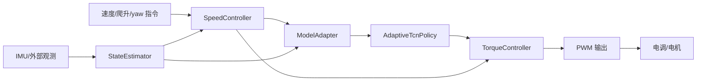

# STM32H750/H743 Flight Control

面向 `STM32H750VBT6` / `STM32H743` 的 C++ 飞控固件工程。这个仓库只放可烧录固件、板级端口、控制链和测试，不放 PC 仿真环境、训练脚本或独立模型参数文件。

仿真、训练、评估和可读模型参数在独立仓库：

- `../stm32h750-flight-sim`
- GitHub: `https://github.com/dkjsiogu/stm32h750-flight-sim`

## 做了什么

- 完整 STM32 飞控主链路：传感器采集、状态估计、速度外环、姿态模型、力矩混控、PWM 输出。
- H743 可烧录工程骨架：ARM toolchain、启动文件、linker script、FreeRTOS 配置、newlib 桩、BSP/driver 接口。
- 姿态控制器：固件内 `AdaptiveTcnPolicy`，使用 16 帧历史状态、TCN 时间核和 RMA latent 自适应。
- 状态估计器：误差状态式姿态融合，外部姿态观测修正姿态和陀螺零偏，速度观测学习世界系加速度慢偏。
- 固件边界测试：防止 PC 仿真、训练、评估代码混入固件核心 target。

## 技术栈

- C++17
- CMake
- FreeRTOS 接口层
- ARM GCC / `arm-none-eabi`
- STM32H743 board skeleton
- CTest

## 控制链路



`src/main.cpp` 是固件装配入口。真实硬件数据通过 `boards/stm32h743/include/board_io.hpp` 的 BSP hook 接入，核心控制代码不依赖仿真真值。

## 模型说明

固件工程里没有 `.pt`、`.onnx`、`.bin` 这类外部模型文件。姿态策略以普通 C++ 代码形式参与编译：

- 前向实现：`src/model/adaptive_tcn_policy.cpp`
- 生成参数代码：`src/model/generated_policy.cpp`
- 固件入口：`make_generated_policy()`

这样做是为了让 STM32 固件不需要文件系统、动态加载器或运行时推理框架。训练侧的可读参数、搜索器和导出脚本在 `stm32h750-flight-sim` 仓库。

当前仿真评估结果来自独立仿真仓库：

| 指标 | 结果 |
|---|---:|
| 稳定场景 | 5/5 |
| 平均分 | 90.894/100 |
| 最弱场景 | gust_recovery = 85.171 |
| H743 stub 镜像 text | 70,560 bytes |

## 目录结构

```text
include/flight_control/        公共头文件
src/app/                       飞控应用任务装配
src/control/                   速度外环和力矩混控
src/estimation/                状态估计器
src/model/                     姿态策略前向和生成参数代码
src/platform/                  STM32/FreeRTOS 端口
boards/stm32h743/              H743 可烧录工程骨架
tests/                         host 单元测试和固件边界测试
helloagents/                   项目知识库
```

## 构建与测试

Host 侧构建和测试：

```bash
cmake -S . -B build
cmake --build build
ctest --test-dir build --output-on-failure
```

固件入口链接验证：

```bash
cmake -S . -B build-firmware-entry \
  -DFLIGHT_CONTROL_BUILD_TESTS=OFF \
  -DFLIGHT_CONTROL_BUILD_FIRMWARE_ENTRY=ON
cmake --build build-firmware-entry
```

H743 stub 镜像构建：

```bash
cmake -S boards/stm32h743 -B build-h743 \
  -DCMAKE_TOOLCHAIN_FILE=boards/stm32h743/toolchain-arm-none-eabi.cmake \
  -DH743_DRIVER_MODE=stub
cmake --build build-h743
```

产物：

```text
build-h743/flight_control_h743.hex
build-h743/flight_control_h743.bin
```

## 真实板部署

真实烧录模式要求补齐 `boards/stm32h743/drivers/real/` 或通过 CMake 传入驱动源文件：

```bash
cmake -S boards/stm32h743 -B build-h743-real \
  -DCMAKE_TOOLCHAIN_FILE=boards/stm32h743/toolchain-arm-none-eabi.cmake \
  -DH743_DRIVER_MODE=real
cmake --build build-h743-real
```

真实 BSP 需要实现这些函数：

```cpp
void board_system_preinit();
bool board_drivers_initialize();
void board_write_failsafe_outputs();
bool board_read_imu_sample(flight_control::SensorPacket* packet);
bool board_read_external_observation(flight_control::StateEstimatorObservation* observation);
bool board_read_guidance_command(flight_control::GuidanceCommand* command);
void board_write_motor_pwm(const flight_control::MotorPwmFrame* frame);
void board_read_estimated_wind(float* wind_x_m_s, float* wind_y_m_s);
float board_control_latency_ms();
void board_enter_critical();
void board_exit_critical();
```

真实模式会启用 FreeRTOS。离线环境可设置 `H743_FREERTOS_KERNEL_DIR` 指向本地 FreeRTOS-Kernel。

## 仿真与训练

本仓库不运行飞机仿真，也不保存训练参数。使用独立仓库：

```bash
cd ../stm32h750-flight-sim
cmake -S . -B build
cmake --build build
./build/flight_control_eval
```

仿真仓库负责飞机动力学、风场、载荷、电机滞后、传感器延迟、模型搜索和闭环评估。训练完成后，它通过导出脚本更新本仓库的 `src/model/generated_policy.cpp`。
